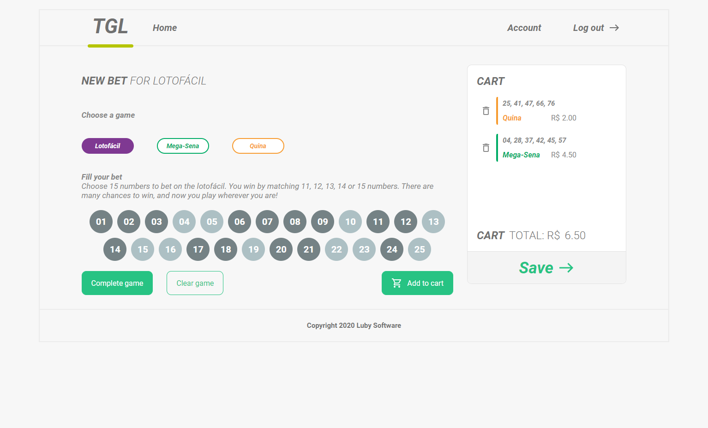

# Desafio final - Fundamentos conteúdo inicial - LabLub
Resolução do desafio final proposto da trilha de conteúdo inicial de JavaScript da LabLuby

## Execução
Para rodar a aplicação basta se conectar a internet e abrir o arquivo `./src/index.html`.

## API Fake
Esta configurado para utilizar uma API Fake gerado no site [Beeceptor](https://beeceptor.com/).
Com isso para funcionar é necessário de uma conexão com a internet.

Você pode trocar a url para a API Fake consumir o arquivo local `./doc/games.json`.

Mais a execução da aplicação vai precisar de um executador para evitar uma regra do `cors`.
Recomendo você recomendo a dependência `Live Serve` para executar.
```javascript
// dentro do arquivo ./src/script.js deixe a função assim
function ExecuteApiFake() {
  let ajax = new XMLHttpRequest();

  let url = "../doc/games.json";
  // let url = "https://lublubydesafiofinal.free.beeceptor.com/";

  // cria um evento para acontecer quando a requisição finalizar
  ajax.onreadystatechange = () => {
    if(ajax.readyState == 4 && ajax.status == 200) {
      database = JSON.parse(ajax.responseText);
      HandleAdjustGameByType();
    }
  };

  ajax.open("GET", url, true);
  ajax.send();
}
```

## Live Serve
Depois de instalar o [Live Server](https://marketplace.visualstudio.com/items?itemName=ritwickdey.LiveServer) basta você clicar com o botão direito encima do arquivo `html` e depois em `Open with Live Serve`.

## Imagens
### Tela de única com o carrinho vazio


### Tela de única clicando no botão complete game


### Tela de única com apostas salva

