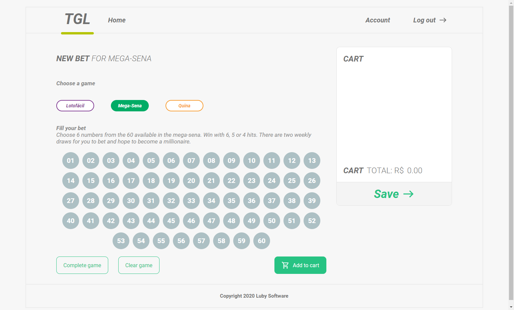
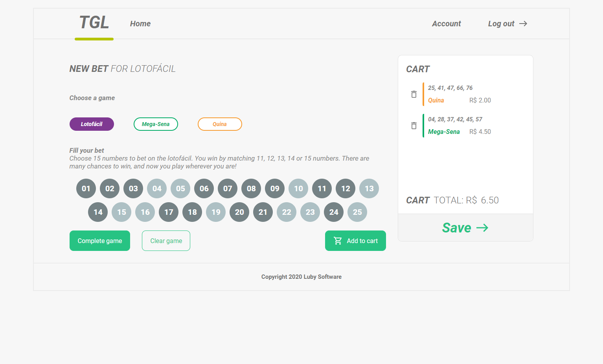
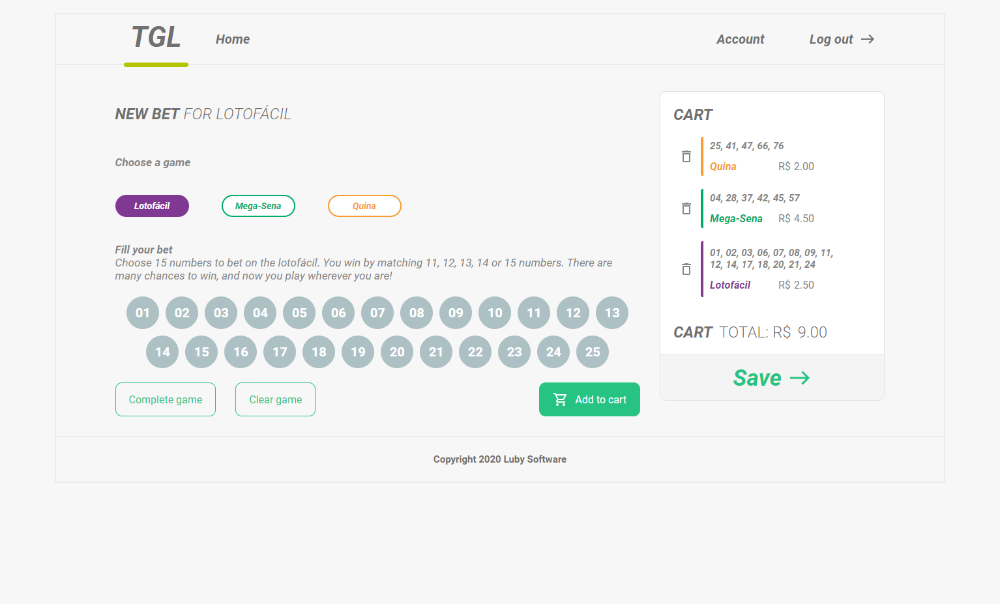

# Prova final - Fundamentos conteúdo inicial - LabLub
Resolução do prova final proposto da trilha de conteúdo inicial de JavaScript da LabLuby

## Execução principal
Você vai precisar de um executador como o [Live Server](https://marketplace.visualstudio.com/items?itemName=ritwickdey.LiveServer) basta você clicar com o botão direito encima do arquivo `html` e depois em `Open with Live Serve`.


## Execução alternativa
Você pode utilizar a API Fake gerado no site [Beeceptor](https://beeceptor.com/).
Mais para funcionar é necessário de uma conexão com a internet.

Você deverá trocar a url dentro da função `ExecuteApiFake` no arquivo `./src/script.js` conforme abaixo
```javascript
function ExecuteApiFake() {
  let ajax = new XMLHttpRequest();

  // cria um evento para acontecer quando a requisição finalizar
  ajax.onreadystatechange = () => {
    if(ajax.readyState == 4 && ajax.status == 200) {
      database = JSON.parse(ajax.responseText);

      CartEmpty();
      CreateButtonGameType();
      HandleAdjustGameByType();
    }
  };

  // let url = "./services/games.json";
  let url = "https://provafinallabluby.free.beeceptor.com";

  ajax.open("GET", url, true);
  ajax.send();
}
```

Assim para executar você precisa somente abrir o arquivo `./src/index.html`

## Imagens
### Página única com o carrinho vazio


### Página única clicando no botão complete game


### Página única com apostas no carrinho

